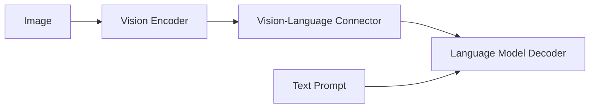
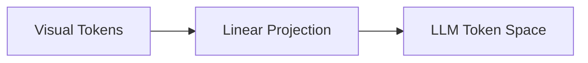
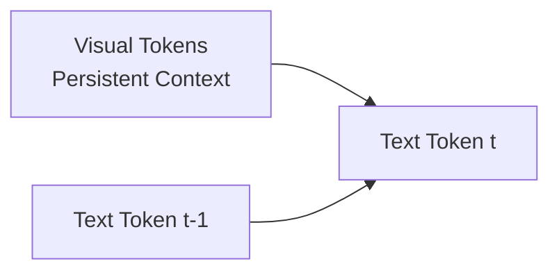

# MOLMO and the Anatomy of Modern Vision-Language Models

## Why MOLMO Is Worth Studying

Most recent discussions around Vision-Language Models (VLMs) revolve around benchmarks, scale, or whether a model is “open” in name. MOLMO is interesting for a different reason. It is one of the few recent VLMs that can be treated as a **complete research artifact**—one where data construction, architectural decisions, training choices, and evaluation all form a coherent story.

This article is not a leaderboard-driven summary of MOLMO. Instead, it uses MOLMO as a **lens to reason about VLM design itself**: where multimodal reasoning actually happens, why many VLMs fail silently, and how architectural decisions upstream of the language model determine what kind of intelligence is even possible downstream.

The central argument is simple but often overlooked:

> Multimodal reasoning does not emerge inside the LLM by default. It emerges only if the architecture preserves, aligns, and exposes visual information in a form the LLM can actually reason over.

MOLMO is valuable because it makes these constraints explicit—and largely gets them right.

## Where Does Multimodal Reasoning Actually Live?

At a high level, most VLMs look deceptively similar: an image encoder, a connector, and a language model. This simplicity hides a deeper question that determines success or failure:

**Where, exactly, does multimodal reasoning occur?**

Not in the vision encoder alone. Not magically inside the LLM. And not in the connector by virtue of existing. Multimodal reasoning only emerges if three conditions are met:

1.  **Visual information survives preprocessing**
    If critical spatial or fine-grained details are destroyed before encoding, no amount of downstream reasoning can recover them.

2.  **Visual tokens are aligned, not merely projected**
    The connector must preserve structure, locality, and layout—not just match embedding dimensions.

3.  **The decoder has unrestricted access to vision during generation**
    Vision must act as persistent context, not a compressed hint.

Most VLM failures trace back to violations of one or more of these constraints, often invisibly.

### A Minimal VLM Abstraction

Conceptually, almost all VLMs can be reduced to the following pipeline:

This diagram is misleadingly clean. The real complexity lies in what happens *inside* each arrow.

*   The **Image → Vision Encoder** step determines what information is even representable.
*   The **Encoder → Connector** step determines what structure survives compression.
*   The **Connector → LLM** step determines whether vision is accessible during reasoning or merely appended as context.

From a research perspective, the most important insight is this:

> The LLM cannot reason over what it cannot attend to, and it cannot attend to what the architecture has already discarded.

MOLMO’s contribution is not that it invents new components, but that it treats these transitions as first-class design problems rather than implementation details. In the sections that follow, we will progressively zoom in on how MOLMO addresses each of these failure modes—starting with the most underestimated part of VLMs: how images are prepared *before* any transformer ever sees them.

## Why MOLMO’s Architecture Is Quietly Radical

At first glance, MOLMO’s architecture looks almost conservative. There is no novel transformer variant, no exotic fusion module, and no end-to-end multimodal pretraining trick that fundamentally alters the standard VLM recipe. This is intentional.

MOLMO’s architectural contribution is not about *inventing new components*, but about **treating known constraints as immovable facts** and designing around them. In particular, it takes seriously a constraint that many VLMs implicitly ignore:

> Vision Transformers are square, resolution-limited models operating on patchified images—while real-world visual reasoning is neither square nor low-resolution.

Most VLMs implicitly assume that resizing an image to a single fixed resolution is a harmless preprocessing step. MOLMO treats this assumption as false.

### The Silent Failure Mode in Many VLMs

Consider what happens in a typical VLM pipeline:

*   A rectangular image is resized to a fixed square resolution (e.g., 224×224 or 336×336).
*   Fine details (text, symbols, small objects) are blurred or aliased.
*   Spatial relationships are distorted.
*   The vision encoder produces tokens that are already missing critical information.

At this point, **the LLM has already lost**, regardless of how powerful it is.

From a modeling perspective, this is not a limitation of transformers or language models—it is an *information bottleneck introduced upstream*. MOLMO’s architecture is built around the idea that **multimodal reasoning capacity is bounded by what survives this bottleneck**.

### MOLMO’s Architectural Stance

MOLMO adopts a clear architectural philosophy:

*   Preserve *global context* without sacrificing *local detail*.
*   Avoid forcing the vision encoder to choose between the two.
*   Expose both scales explicitly to the language model.

This leads to an architecture that is modular but principled:

Nothing here is exotic—but every block exists for a reason. The key insight is that **the preprocessor is not a systems convenience layer**. It is a modeling decision that directly shapes what the LLM can reason about.

From an AI research perspective, MOLMO reframes where architectural novelty should live: not necessarily in deeper encoders or larger language models, but in **how visual evidence is preserved, structured, and made accessible to reasoning mechanisms**.

This is why MOLMO is better understood as an architectural *correction* rather than an architectural *innovation*. It does not add complexity; it removes implicit assumptions that were never justified.

## The Image Preprocessor: Letting Vision Survive the Journey

In most VLM discussions, the image preprocessor is treated as an implementation detail. In MOLMO, it is the architectural keystone.

The problem MOLMO confronts is structural, not empirical: **Vision Transformers operate on fixed-size square inputs, while real images are rectangular, high-resolution, and information-dense**. Any attempt to force one into the other introduces irreversible loss.

Rather than asking the vision encoder to do more, MOLMO changes what it is asked to see.

### The Core Mismatch: ViTs vs. Real Images

Vision Transformers like ViT-L/14 accept inputs of a fixed resolution (e.g., 336×336). This creates an unavoidable trade-off:

*   Resize aggressively → preserve global layout, lose fine detail.
*   Crop aggressively → preserve detail, lose context.

Most VLMs choose one side of this trade-off implicitly. MOLMO refuses to choose. Instead, it reframes the problem:

> What if the vision encoder sees *multiple coherent views* of the same image, each optimized for a different level of abstraction?

### Multi-Scale Tiling as a Representation Strategy

MOLMO’s preprocessor produces **two complementary visual representations** from a single image:

1.  **A low-resolution global view**
    *   The entire image resized to 336×336.
    *   Preserves scene-level context, object co-occurrence, and layout.

2.  **Multiple high-resolution overlapping crops**
    *   Each crop is 336×336.
    *   Covers the image on a grid.
    *   Overlaps adjacent crops to avoid boundary artifacts.

This is not a data augmentation trick. It is a **deliberate representational decomposition**:

Each crop answers a different question:
*   *What is happening overall?*
*   *What fine details exist here?*
*   *What text or small objects would be lost otherwise?*

### Why Overlap Matters (More Than It Seems)

The overlapping region between crops is not incidental. Without overlap, objects near crop boundaries get split, text gets truncated, and spatial continuity breaks. By overlapping crops, MOLMO ensures that **any visually meaningful region appears fully in at least one crop**. This guarantees that the vision encoder never sees “half an object” as its best view.

From a reasoning perspective, this is crucial. The LLM can only reason over *complete visual evidence*, not fragmented patches.

### Padding Is Also a Modeling Choice

Real images rarely tile perfectly. MOLMO pads edge crops when needed, but does so explicitly:
*   Each patch is tagged as real image, partial padding, or full padding.
*   Padding-type embeddings tell the model what is *absence* versus *dark pixels*.

This avoids a subtle but common failure mode where models confuse black padding with visual content—particularly harmful in low-light or nighttime scenes.

The key insight here is not multi-scale cropping itself, but what it represents: **visual reasoning is scale-sensitive**. A single resolution cannot support both perception and interpretation. MOLMO treats scale as a **first-class axis of representation**, rather than something the model is expected to infer implicitly.

## From Patches to Tokens: Controlling Visual Bandwidth Without Losing Semantics

Once MOLMO has preserved visual information through multi-scale preprocessing, it faces the next architectural bottleneck: **token explosion**.

Vision Transformers do not reason over images directly—they reason over *patch tokens*. If left unchecked, MOLMO’s careful preprocessing would overwhelm the language model with far more visual tokens than it can meaningfully attend to.

The challenge here is subtle:

> How do we aggressively compress visual information **without destroying the very fine-grained details we preserved**?

MOLMO’s answer is not to reduce input resolution, but to **compress intelligently after semantic extraction**.

### Patchification: Where Token Explosion Begins

Each 336×336 image (global view or crop) is divided into 14×14 pixel patches.
*   336 / 14 = 24 patches per side
*   Total per image: **24 × 24 = 576 patches**
*   If MOLMO processed 9 crops + 1 global image naively, this would result in **~5,760 visual tokens**.

This is not just inefficient—it is unusable for a decoder-only LLM that must attend over all tokens during generation.

### Multi-Layer Feature Extraction: Texture Meets Semantics

Before compression, MOLMO makes one important modeling decision: it extracts features from **two internal ViT layers**:
*   A mid-level layer → captures textures, edges, local patterns
*   A late layer → captures object-level and semantic information

These are combined before pooling. This reflects a researcher’s intuition: fine-grained visual reasoning often depends on *both* texture-level evidence and semantic abstraction. Discarding either prematurely harms downstream grounding.

### 2×2 Attention Pooling: Semantic Compression

Instead of uniform pooling or token dropping, MOLMO applies **2×2 attention pooling**:
*   Every 2×2 group of neighboring patches → one pooled token
*   Spatial resolution per image: 24×24 → 12×12
*   576 tokens → **144 tokens**

This pooling is *attention-based*, not average pooling:

From a modeling perspective, this is critical: tokens now represent *regions*, not pixels. Each token still corresponds to a localized part of the image, allowing the LLM to reason over regions rather than raw patches.

### Removing Redundancy Across Overlapping Crops

Because crops overlap, some regions appear multiple times. MOLMO explicitly removes duplicate tokens corresponding to overlapping areas. The result is roughly **~1100 unique visual tokens** for an entire high-resolution image, with no double-counting and no fragmented evidence.

From an AI research perspective, this is best understood as **visual bandwidth control**. The goal is not to feed the LLM more pixels, but to feed it *the right abstractions at the right granularity*.

## The Connector Is Not a Projection Layer

In many VLM descriptions, the connector is dismissed in a single sentence: *“visual features are projected into the language embedding space.”* MOLMO treats this as an oversimplification—and implicitly argues that this framing is one reason many VLMs underperform at grounding and reasoning.

The connector is not just about dimensionality alignment. It is about **making visual structure legible to a language model**.

### The Common Misconception

A naïve mental model of VLMs looks like this:

If this were sufficient, most VLMs would reason well about space, count objects reliably, and ground references precisely. They do not. The reason is simple:

> Language models do not natively understand spatial structure. If spatial information is not explicitly encoded, it is effectively invisible.

### Layout Tokens: Giving Vision a Coordinate System

MOLMO distinguishes between **alignment** (tokens live in the same embedding space) and **accessibility** (the LLM can reliably use visual information). To bridge this gap, MOLMO augments each visual token with **explicit layout information**:
*   Token position within the image grid
*   Which crop it originated from
*   Relative spatial location

This information is encoded using **layout embeddings**, which are injected alongside visual features before entering the LLM. Conceptually, layout injection looks like this:

The key idea is not positional encoding in the transformer sense—it is *semantic spatial grounding*. To the LLM, these tokens are no longer anonymous vectors. They are “this region,” “over here,” or “adjacent to that other region.”

### Why This Matters for Reasoning

From a researcher’s perspective, this section is where MOLMO’s architectural philosophy becomes clear: **multimodal reasoning is not just about fusing modalities—it is about preserving the *structure* of each modality through fusion**.

Without layout-aware connectors, counting degenerates into guesswork and spatial explanations collapse into generic captions. MOLMO’s connector ensures that visual tokens behave less like “extra words” and more like **persistent, structured memory**.

## Decoding With Vision: How MOLMO Actually Reasons Over Images

Up to this point, MOLMO has preserved visual information, compressed it without destroying structure, and aligned it with language in a spatially meaningful way. The final question is whether this information is actually *used* during reasoning.

A VLM can have excellent visual representations and still behave like a captioning model if its decoder treats vision as a static prefix rather than an active source of evidence. MOLMO is explicit about avoiding this failure mode.

### Decoder-Only, But Not Vision-Blind

MOLMO uses a **decoder-only language model**. This choice is deliberate. During generation:
*   **Visual tokens are fully visible at every decoding step**
*   **Text tokens are causally masked**

This creates an asymmetric attention pattern:

The implication is subtle but critical: **the model can always re-attend to the entire visual scene while generating each new word.** Vision is not something the model “reads once and forgets.” It functions as a **persistent external memory**.

### Why This Matters for Reasoning

Many VLM failures arise because vision is treated as a compressed hint—a short prefix or limited attention window. In such setups, early decoding decisions lock in interpretations that cannot be revised. MOLMO’s decoding strategy enables:
*   Re-checking spatial relationships mid-generation
*   Revisiting visual evidence when resolving ambiguity
*   Maintaining consistency between earlier and later claims

This is especially important for tasks like counting (“there are three cups, not two”) or referring expressions (“the object on the left, not the center”), where the answer depends on constant verification against visual evidence.

## Why Data Still Matters — But Only If Architecture Lets It

Up to this point, the discussion has focused almost entirely on architecture. This is intentional. MOLMO makes a strong implicit claim:

> Data does not create capabilities by itself. It only reveals the capabilities that the architecture already permits.

PixMo, MOLMO’s data suite, is best understood through this lens—not as a collection of large datasets, but as **capability probes** designed to exercise specific architectural affordances.

### PixMo as Capability Supervision, Not Scale

Rather than enumerating PixMo datasets individually, it is more useful to group them by *what they are trying to teach the model to do*:

| Capability | PixMo Subset | Architectural Dependency |
| :- | :- | :- |
| Dense visual grounding | PixMo-CAP | Persistent visual memory |
| Counting & enumeration | PixMo-Count | Spatially structured tokens |
| Pointing & localization | PixMo-Points | Layout-aware connectors |
| Document understanding | PixMo-Docs | Multi-scale preprocessing |
| Geometric reasoning | PixMo-Clocks | Region-level attention |

The important observation is that **none of these capabilities would emerge reliably** if MOLMO used single-resolution resizing, aggressive early pooling, or vision-as-prefix decoding. In other words, PixMo does not compensate for architectural weaknesses—it *assumes they have already been addressed*.

### A Common Failure Pattern in VLM Training

Many VLMs follow an implicit strategy: collect diverse multimodal data, mix everything into instruction tuning, and hope scale smooths over inconsistencies. This often leads to models that caption fluently but hallucinate spatial facts or perform poorly at grounding.

MOLMO avoids this by enforcing a clean separation:
*   **Architecture** defines *what is possible*.
*   **Data** teaches the model *when to use it*.

### The Broader Lesson

A useful mental model is to think in terms of ceilings: a weak architecture creates a low ceiling, no matter how much data is added. PixMo pushes MOLMO toward its architectural limits, but it does not redefine those limits.

The takeaway is not “data matters less,” but something more precise: **in VLMs, architecture determines *which datasets are even learnable***.

With this in mind, we can step back and ask a final, forward-looking question: what does MOLMO teach us about the future design of vision-language systems? It teaches us that distinct architectural choices—not just scale—will define the limits of what our models can truly understand.
