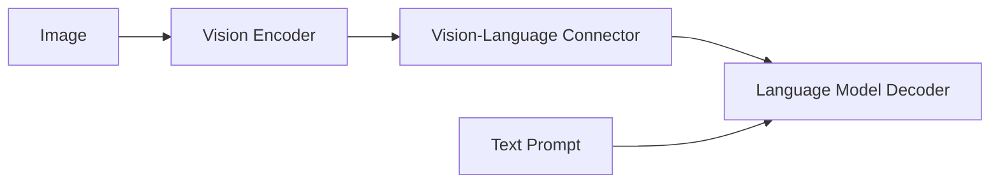

**Part 1 of a 4-part series on Vision-Language Model design.**  
← Previous | [Next →](/blog/molmo-part-2)

---

# Where Multimodal Reasoning Actually Lives

> [!NOTE]
> **What this article is (and is not)**
>
> This is not a benchmark comparison, reproduction, or implementation guide for MOLMO. All quantitative results, ablations, and evaluations are in the original paper.
>
> This article is a researcher's interpretation of what MOLMO is actually saying about VLM design: which constraints it treats as fundamental, which failure modes it prioritizes, and where it chooses architectural clarity over convenience. The focus is on design reasoning, not performance deltas.

## Why MOLMO Is Worth Studying

Most recent discussions around Vision-Language Models (VLMs) revolve around benchmarks, scale, or whether a model is "open" in name. MOLMO is interesting for a different reason. It is one of the few recent VLMs that can be treated as a **complete research artifact**—one where data construction, architectural decisions, training choices, and evaluation all form a coherent story.

This article is not a leaderboard-driven summary of MOLMO. Instead, it uses MOLMO as a **lens to reason about VLM design itself**: where multimodal reasoning actually happens, why many VLMs fail silently, and how architectural decisions upstream of the language model determine what kind of intelligence is even possible downstream.

The central argument is simple but often overlooked:

> Multimodal reasoning does not emerge inside the LLM by default. It emerges only if the architecture preserves, aligns, and exposes visual information in a form the LLM can actually reason over.

MOLMO is valuable because it makes these constraints explicit—and largely gets them right.

### Why "Open" Actually Matters Here

Many VLMs claim openness but fall short in practice:

* **API-only** (GPT-4o, Gemini): No weights, no data, no reproducibility.
* **Open weights, closed data** (Qwen-VL, InternVL): You can run it, but you cannot study *why* it works.
* **Open weights + distilled data** (LLaVA, Cambrian): Trained on synthetic captions from proprietary VLMs—meaning reproducibility still depends on closed systems.

MOLMO occupies a different position: **open weights, open data (PixMo), and open training code**. This means the entire system—from data collection decisions to architectural choices—can be audited, reproduced, and extended. For researchers, this is not a marketing distinction; it is the difference between a benchmark result and a research artifact.

---

## The Core VLM Abstraction

At a high level, most VLMs look deceptively similar: an image encoder, a connector, and a language model. This simplicity hides a deeper question that determines success or failure:

**Where, exactly, does multimodal reasoning occur?**

Not in the vision encoder alone. Not magically inside the LLM. And not in the connector by virtue of existing. Multimodal reasoning only emerges if three conditions are met:

1. **Visual information survives preprocessing**  
   If critical spatial or fine-grained details are destroyed before encoding, no amount of downstream reasoning can recover them.

2. **Visual tokens are aligned, not merely projected**  
   The connector must preserve structure, locality, and layout—not just match embedding dimensions.

3. **The decoder has unrestricted access to vision during generation**  
   Vision must act as persistent context, not a compressed hint.

Most VLM failures trace back to violations of one or more of these constraints, often invisibly.

### A Minimal VLM Abstraction

Conceptually, almost all VLMs can be reduced to the following pipeline:

This diagram is misleadingly clean. The real complexity lies in what happens *inside* each arrow.

* The **Image → Vision Encoder** step determines what information is even representable.
* The **Encoder → Connector** step determines what structure survives compression.
* The **Connector → LLM** step determines whether vision is accessible during reasoning or merely appended as context.

MOLMO's architecture follows this standard design—connecting a vision encoder to a language model—as shown in Figure 2 from the paper:

*Figure 2: MOLMO's end-to-end inference flow. An image is tiled into crops, encoded, and fused with tokenized text. The LLM outputs an answer with optional pointing coordinates.*

---

## Where Multimodal Reasoning Fails

From a research perspective, the most important insight is this:

> The LLM cannot reason over what it cannot attend to, and it cannot attend to what the architecture has already discarded.

Consider what happens in a typical VLM pipeline:

* A rectangular image is resized to a fixed square resolution (e.g., 224×224 or 336×336).
* Fine details (text, symbols, small objects) are blurred or aliased.
* Spatial relationships are distorted.
* The vision encoder produces tokens that are already missing critical information.

At this point, **the LLM has already lost**, regardless of how powerful it is.

MOLMO's contribution lies in treating these transitions as first-class design problems rather than implementation details. In the parts that follow, we will progressively zoom in on how MOLMO addresses each of these failure modes—starting with the most underestimated part of VLMs: how images are prepared *before* any transformer ever sees them.

---

**Part 1 of a 4-part series on Vision-Language Model design.**  
← Previous | [Next →](/blog/molmo-part-2)
