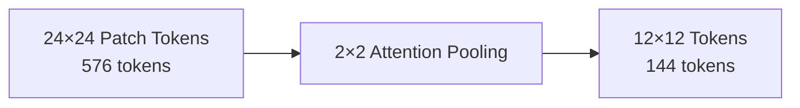
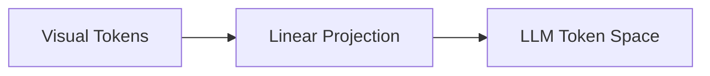

**Part 3 of a 4-part series on Vision-Language Model design.**  
[← Previous](/blog/molmo-part-2) | [Next →](/blog/molmo-part-4)

---

# From Patches to Reasoning: Tokens, Bandwidth, and Connectors

Once MOLMO has preserved visual information through multi-scale preprocessing, it faces the next architectural bottleneck: **token explosion**.

Vision Transformers do not reason over images directly—they reason over *patch tokens*. If left unchecked, MOLMO's careful preprocessing would overwhelm the language model with far more visual tokens than it can meaningfully attend to.

The challenge here is subtle:

> How do we aggressively compress visual information **without destroying the very fine-grained details we preserved**?

MOLMO's answer is not to reduce input resolution, but to **compress intelligently after semantic extraction**.

---

## Patchification: Where Token Explosion Begins

Each 336×336 image (global view or crop) is divided into 14×14 pixel patches.
* 336 / 14 = 24 patches per side
* Total per image: **24 × 24 = 576 patches**
* If MOLMO processed 9 crops + 1 global image naively, this would result in **~5,760 visual tokens**.

This is not just inefficient—it is unusable for a decoder-only LLM that must attend over all tokens during generation.

---

## Multi-Layer Feature Extraction: Texture Meets Semantics

Before compression, MOLMO makes one important modeling decision: it extracts features from **two internal ViT layers**:
* A mid-level layer → captures textures, edges, local patterns
* A late layer → captures object-level and semantic information

These are combined before pooling. This reflects a researcher's intuition: fine-grained visual reasoning often depends on *both* texture-level evidence and semantic abstraction. Discarding either prematurely harms downstream grounding.

---

## 2×2 Attention Pooling: Semantic Compression

Instead of uniform pooling or token dropping, MOLMO applies **2×2 attention pooling**:
* Every 2×2 group of neighboring patches → one pooled token
* Spatial resolution per image: 24×24 → 12×12
* 576 tokens → **144 tokens**

This pooling is *attention-based*, not average pooling:

From a modeling perspective, this is critical: tokens now represent *regions*, not pixels. Each token still corresponds to a localized part of the image, allowing the LLM to reason over regions rather than raw patches.

---

## Removing Redundancy Across Overlapping Crops

Because crops overlap, some regions appear multiple times. MOLMO explicitly removes duplicate tokens corresponding to overlapping areas. The result is roughly **~1100 unique visual tokens** for an entire high-resolution image, with no double-counting and no fragmented evidence.

From an AI research perspective, this is best understood as **visual bandwidth control**. The goal is not to feed the LLM more pixels, but to feed it *the right abstractions at the right granularity*.

---

## Putting It Together: A Walkthrough

To make this concrete, consider a 1920×1080 image of a busy café street:

| Step | Operation                 | Result                                            |
| ---- | ------------------------- | ------------------------------------------------- |
| 1    | Input image               | 1920×1080×3 RGB                                   |
| 2    | Create global view        | 336×336 (entire scene, scaled down)               |
| 3    | Create high-res crops     | ~8 overlapping 336×336 tiles with 56px overlap    |
| 4    | Patchify each crop        | 24×24 = 576 patches per crop (14×14px patches)    |
| 5    | ViT encoding              | Each patch → 1024-D vector                        |
| 6    | Multi-layer extraction    | Mid + late layer features combined                |
| 7    | 2×2 attention pooling     | 576 → 144 tokens per crop                         |
| 8    | Remove overlap duplicates | ~9 crops × 144 ≈ 1,296 → **~1,100 unique tokens** |
| 9    | Connector projection      | 1,100 × 1024-D → 1,100 × 4096-D                   |
| 10   | Add layout tokens         | `<img_start_lowres>`, `<row_end>`, etc.           |
| 11   | Concatenate with text     | [1,100 visual] + [~8 text tokens] → LLM           |

The LLM then generates text autoregressively, attending to all visual tokens at each step. When asked *"What color is the car near the café?"*, it can localize "car" to specific visual tokens and verify "near the café" spatially—because the architecture preserved this structure throughout.

---

## The Connector Is Not a Projection Layer

In many VLM descriptions, the connector is dismissed in a single sentence: *"visual features are projected into the language embedding space."* MOLMO treats this as an oversimplification—and implicitly argues that this framing is one reason many VLMs underperform at grounding and reasoning.

The connector is not just about dimensionality alignment. It is about **making visual structure legible to a language model**.

### The Common Misconception

A naïve mental model of VLMs looks like this:

If this were sufficient, most VLMs would reason well about space, count objects reliably, and ground references precisely. They do not. The reason is simple:

> Language models do not natively understand spatial structure. If spatial information is not explicitly encoded, it is effectively invisible.

---

## Layout Tokens: Giving Vision a Coordinate System

MOLMO distinguishes between **alignment** (tokens live in the same embedding space) and **accessibility** (the LLM can reliably use visual information). To bridge this gap, MOLMO augments each visual token with **explicit layout information**:
* Token position within the image grid
* Which crop it originated from
* Relative spatial location

This information is encoded using **layout embeddings**, which are injected alongside visual features before entering the LLM.

*Layout injection adds positional context to each visual token, enabling the LLM to understand spatial relationships.*

The key idea is not positional encoding in the transformer sense—it is *semantic spatial grounding*. To the LLM, these tokens are no longer anonymous vectors. They are "this region," "over here," or "adjacent to that other region."

---

## Why This Matters for Reasoning

From a researcher's perspective, this section is where MOLMO's architectural philosophy becomes clear: **multimodal reasoning is not just about fusing modalities—it is about preserving the *structure* of each modality through fusion**.

Without layout-aware connectors, counting degenerates into guesswork and spatial explanations collapse into generic captions. MOLMO's connector ensures that visual tokens behave less like "extra words" and more like **persistent, structured memory**.

---

**Part 3 of a 4-part series on Vision-Language Model design.**  
[← Previous](/blog/molmo-part-2) | [Next →](/blog/molmo-part-4)
