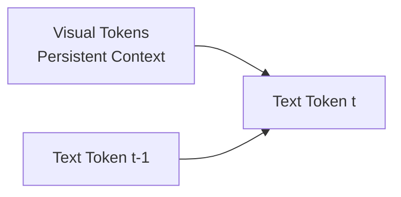

**Part 4 of a 4-part series on Vision-Language Model design.**  
[← Previous](/blog/molmo-part-3) | Next →

---

# When Architecture Meets Data: What MOLMO Teaches Us

Up to this point, MOLMO has preserved visual information, compressed it without destroying structure, and aligned it with language in a spatially meaningful way. The final question is whether this information is actually *used* during reasoning.

A VLM can have excellent visual representations and still behave like a captioning model if its decoder treats vision as a static prefix rather than an active source of evidence. MOLMO is explicit about avoiding this failure mode.

---

## Decoder-Only, But Not Vision-Blind

MOLMO uses a **decoder-only language model**. This choice is deliberate. During generation:
* **Visual tokens are fully visible at every decoding step**
* **Text tokens are causally masked**

This creates an asymmetric attention pattern:

The implication is subtle but critical: **the model can always re-attend to the entire visual scene while generating each new word.** Vision is not something the model "reads once and forgets." It functions as a **persistent external memory**.

---

## Vision as Persistent Memory

Many VLM failures arise because vision is treated as a compressed hint—a short prefix or limited attention window. In such setups, early decoding decisions lock in interpretations that cannot be revised. MOLMO's decoding strategy enables:

* Re-checking spatial relationships mid-generation
* Revisiting visual evidence when resolving ambiguity
* Maintaining consistency between earlier and later claims

This is especially important for tasks like counting ("there are three cups, not two") or referring expressions ("the object on the left, not the center"), where the answer depends on constant verification against visual evidence.

---

## Why Data Still Matters — But Only If Architecture Lets It

Up to this point, the discussion has focused almost entirely on architecture. This is intentional. MOLMO makes a strong implicit claim:

> Data does not create capabilities by itself. It only reveals the capabilities that the architecture already permits.

PixMo, MOLMO's data suite, is best understood through this lens—not as a collection of large datasets, but as **capability probes** designed to exercise specific architectural affordances.

---

## PixMo as Capability Supervision, Not Scale

Rather than enumerating PixMo datasets individually, it is more useful to group them by *what they are trying to teach the model to do*:

| Capability              | PixMo Subset     | Scale                          | Key Feature                                                                           |
| :---------------------- | :--------------- | :----------------------------- | :------------------------------------------------------------------------------------ |
| Dense captioning        | PixMo-CAP        | 712K images, 1.3M captions     | **Voice-first**: annotators speak 60-90s descriptions (~196 words avg vs. 11 in COCO) |
| Visual Q&A              | AskModelAnything | 162K QA pairs / 73K images     | Human-in-the-loop with text-only LLM (no VLM supervision)                             |
| Pointing & grounding    | PixMo-Points     | 2.3M expressions / 229K images | 10× larger than RefCOCO; enables "count-by-pointing"                                  |
| Caption-based reasoning | PixMo-CapQA      | 214K QA / 165K images          | Caption → QA conversion via text LLM                                                  |
| Document understanding  | PixMo-Docs       | 255K images, 2.3M QA           | Code-generated charts (Matplotlib, LaTeX, Mermaid, etc.)                              |
| Visual numeracy         | PixMo-Clocks     | 826K images                    | Synthetic watch faces; teaches geometric → numeric reasoning                          |
| Grounded counting       | PixMo-Count      | 36K train / 540 val            | Point-based counting supervision; harder than CountBenchQA                            |

The key insight is that **none of these capabilities would emerge reliably** if MOLMO used single-resolution resizing, aggressive early pooling, or vision-as-prefix decoding. PixMo does not compensate for architectural weaknesses—it *assumes they have already been addressed*.

Figure 1 from the paper shows how PixMo datasets map to MOLMO's capabilities:

*Figure 1: PixMo (left) consists of three annotated datasets and four synthetic datasets, all constructed without the use of VLMs. Each dataset enables specific capabilities in MOLMO (right), from fine-grained understanding to pointing and visual skills.*

---

## How Well Does It Work?

MOLMO's results validate the architectural philosophy:

| Metric                   | Result                                                                                                                                                 |
| ------------------------ | ------------------------------------------------------------------------------------------------------------------------------------------------------ |
| **Overall ranking**      | Molmo-72B ranks **#2** (behind only GPT-4o), beating Gemini 1.5 Pro and Claude 3.5 Sonnet                                                              |
| **Counting & grounding** | Best-in-class due to point-then-count reasoning and 2D pointing data                                                                                   |
| **cap-F1 correlation**   | Strong 0.82 correlation between captioning quality and benchmark performance—suggesting dense captioning is a reliable proxy for multimodal capability |
| **Openness**             | First fully open VLM (weights, data, code) to reach this performance tier                                                                              |

Where MOLMO is weaker: reasoning-heavy tasks (MathVista) and fine OCR, which require more structured reasoning data.

---

## A Common Failure Pattern in VLM Training

Many VLMs follow an implicit strategy: collect diverse multimodal data, mix everything into instruction tuning, and hope scale smooths over inconsistencies. This often leads to models that caption fluently but hallucinate spatial facts or perform poorly at grounding.

MOLMO avoids this by enforcing a clean separation:
* **Architecture** defines *what is possible*.
* **Data** teaches the model *when to use it*.

---

## The Broader Lesson

A useful mental model is to think in terms of ceilings: a weak architecture creates a low ceiling, no matter how much data is added. PixMo pushes MOLMO toward its architectural limits, but it does not redefine those limits.

The takeaway is not "data matters less," but something more precise: **in VLMs, architecture determines *which datasets are even learnable***.

---

## What MOLMO Teaches Us About VLM Design

With this in mind, we can step back and ask a final, forward-looking question: what does MOLMO teach us about the future design of vision-language systems?

1. **Preprocessing is modeling.** The image preprocessor is not infrastructure—it is the first layer of representation learning.

2. **Compression must be semantically aware.** Token reduction should happen after, not before, semantic features are extracted.

3. **Connectors must preserve structure.** Dimensionality alignment is necessary but not sufficient.

4. **Vision must remain accessible.** The decoder should treat visual tokens as persistent context, not a one-time input.

5. **Data reveals architecture.** Training data can only teach capabilities that the architecture already permits.

MOLMO demonstrates that distinct architectural choices—not just scale—will define the limits of what our models can truly understand.

---

## Acknowledgments

> **Disclosure:** Parts of this blog series were generated with the assistance of AI tools. The content has been reviewed and curated for technical accuracy.

This blog series was created with assistance from:

* **[MOLMO Paper](https://arxiv.org/abs/2409.17146)** — Deitke et al., "Molmo and PixMo: Open Weights and Open Data for State-of-the-Art Multimodal Models" (2024)
* **[Original Presentation Slides](/blog/cs8803-vlm---molmo-and-pixmo)** — CS8803 VLM course presentation with detailed speaker notes
* **[ChatGPT](https://openai.com/chatgpt)** — OpenAI's language model, used for drafting and editing
* **[Antigravity](https://deepmind.google/)** — Google DeepMind's agentic coding assistant, used for structuring and publishing

---

**Part 4 of a 4-part series on Vision-Language Model design.**  
[← Previous](/blog/molmo-part-3) | Next →
