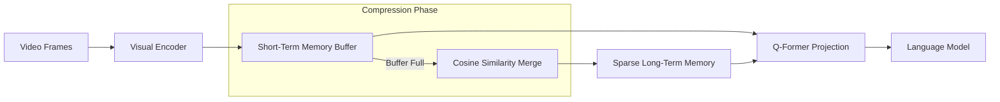

  <strong>Note:</strong> This article is an adapted review of the paper "MovieChat: From Dense Token to Sparse Memory for Long Video Understanding," originally evaluated for the GT SAI Fall 2025 cohort.

## The Challenge of Ultra-Long Video

Understanding long-form video (beyond short 10-second TikTok-style clips) is one of the most computationally hostile problems in modern AI. Traditional Video-LLMs like Video-LLaMA or VideoChat perform admirably on short sequences but hit a brick wall when analyzing entire movies. 

Because Transformer self-attention scales quadratically, dumping thousands of dense video frame tokens into an LLM causes GPU memory requirements to explode. Existing models tend to consume hundreds of megabytes of VRAM *per frame*, forcing massive truncation and causing the model to completely forget earlier context.

MovieChat directly addresses this failure mode by introducing a sparse memory mechanism.

> By aggressively assuming that adjacent video frames contain extreme redundancy, MovieChat structurally forces the architecture to merge adjacent tokens, dropping VRAM consumption violently from ~200MB per frame to just 21.3KB.

---

## The Architecture: Compressing Time

Rather than attempting to process a massive, dense block of video features simultaneously, MovieChat sequentially processes frames and routes them through a biologically inspired memory hierarchy:

1. **Visual Feature Extraction:** Frames are processed sequentially strictly through an image encoder (like EVA-CLIP) rather than a heavy, computationally expensive 3D video encoder.
2. **Short-Term Memory (STM):** An active buffer that holds only the most recent frames. Once the STM fills up, its contents are summarized and flushed into the Long-Term Memory.
3. **Long-Term Memory (LTM) & Token Merging:** This is the core architectural innovation of MovieChat. The LTM stores compressed versions of earlier frames. To prevent the LTM from growing infinitely, MovieChat iteratively calculates the **cosine similarity** between adjacent tokens. The most similar adjacent frames are merged via weighted averaging until only a sparse, minimal representation remains. 
4. **Projection:** Using a Q-Former, both the STM and the LTM are projected directly into the LLM's language token space. 

---

## Inference Modes and Validation

MovieChat validates its architecture by introducing **MovieChat-1K**, a dataset explicitly designed for ultra-long context, featuring 1,000 videos exceeding 10,000 frames each.

During inference, it switches between a **Global Mode** (relying solely on LTM for overarching plot questions) and a **Breakpoint Mode** (combining LTM and STM for pinpoint moment questions). Ablation studies strongly back the architecture: stripping out the STM and LTM causes global accuracy to plummet from 68% down to 51%.

---

## Strengths and Weaknesses

MovieChat offers an elegant systemic fix to an unavoidable hardware constraint, but it makes aggressive assumptions about visual pacing.

### Strengths
* **Psychologically Grounded Efficiency:** Breaking memory into STM and LTM prevents context collapse while gracefully handling computational scaling.
* **Massive Resource Reduction:** Dropping the per-frame memory cost to 21KB means this model can parse 10,000-frame videos easily on a standard 24GB consumer GPU.
* **Dual Inference Modes:** The ability to dynamically isolate overarching thematic reasoning (Global Mode) from specific moment recall (Breakpoint Mode) maps perfectly to real-world QA use cases.

### Weaknesses
* **Non-Adaptive Token Pruning:** Because the token pruning is uniform across temporal segments, a dense, high-action sequence gets compressed just as aggressively as a silent, static shot, potentially destroying critical local context.
* **Visual Ignorance of Audio:** It completely discards the audio modality. Trying to analyze a movie plot without hearing the dialogue inherently caps the logical reasoning ceiling of the model.
* **Extreme Scaling Limits:** Despite the efficiency gains, accuracy still begins to meaningfully degrade on videos exceeding the 10-minute mark.

---

## Open Questions

Evaluating this paper raises a few core questions regarding novelty, cost, and information degradation:

**Is MovieChat the first to use cosine similarity filtering on videos?**  
Cosine similarity is a fundamental mathematical construct used heavily in NLP. However, MovieChat is widely noted as a pioneering framework explicitly applying iterative adjacent cosine similarity merging *directly within a Transformer's Long-Term Memory buffer* specifically to solve ultra-long video redundancy. The novelty lies in where and how they apply the math to achieve the 10,000x memory reduction.

**How intense is the compute and memory training cost?**  
Drastically lower than its predecessors. Because of the aggressive token pruning, MovieChat avoids dense quadratic scaling. Researchers verify that MovieChat can process massive 10,000+ frame videos utilizing a single standard 24GB consumer GPU (like an RTX 3090/4090).

**Does the ablation study show negative impacts from information loss?**  
Yes. The paper openly acknowledges that the token reduction process is highly uniform and non-adaptive. Because it blindly compresses blocks based on a predetermined ratio rather than content importance, dense nuanced events can be overwritten. The architectural ablation studies prove that without the exact structural balance of STM and LTM, the naive token pruning causes catastrophic forgetting.